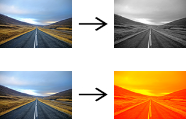

# Gradient Map

Apply gradient map to an image file

Requirements:
*   `cv2`, `numpy` and `matplotlib`

Params:
*   `python gradiend_map.py -i filename.jpg` Input image file. (jpg or png)
*   `python gradiend_map.py -o filename.jpg` Output file name. (default: image_mapped.jpg)
*   `python gradiend_map.py -w` Hexadecimal color for white end of spectrum. (default: #000000)
*   `python gradiend_map.py -b` Hexadecimal color for black end of spectrum. (default: #ffffff)
*   `python gradiend_map.py -h` to show more info

Usage:
*   `python gradiend_map.py -i 'image.jpg'` Creates a black and white copy of the image named image_mapped.jpg
*   `python gradiend_map.py -i 'image.jpg' -o 'something.jpg'` Creates a black and white copy of the image named something.jpg
*   `python gradiend_map.py -i 'image.jpg' -w '#ffff00' -b '#ff0000'` Creates an image going from yellow to red named image_mapped.jpg
