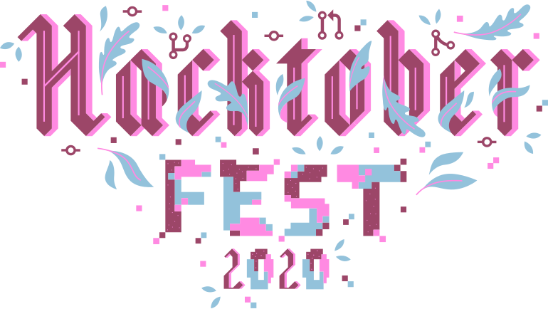

  

# Guidelines for Hacktoberfest 2020:
## About Hacktoberfest:

Hacktoberfest is organised by DigitalOcean in partnership with Dev & Intel. It is a month-long celebration of open-source software. Maintainers are invited to guide the contributors who would like to work in the issues so that the project gets better, and contributors get the opportunity to give back to both projects they like and others they've just discovered. No contribution is too small — bug fixes and documentation updates are valid ways of participating.

**Disclaimer: "Quality matters not quantity."**
*For more informations and resources do check:* [Hacktoberfest](https://hacktoberfest.digitalocean.com/details).
## RULES :

- *Hacktoberfest* is open to everyone. Whether you’re a seasoned contributor or looking for projects to contribute to for the first time, you’re welcome to participate.

- Pull requests can be made in any participating GitHub-hosted repositories/projects.

- Maintainers can opt-in to participate by classifying their projects with the hacktoberfest topic.

- Your pull requests will count toward your participation if they are in a repository with the **hacktoberfest** topic and once they have been merged, approved by a maintainer or labelled as *hacktoberfest-accepted*.

- Additionally, any pull request with the **hacktoberfest-accepted** label, submitted to any public GitHub repository, with or without the hacktoberfest topic, will be considered valid for Hacktoberfest.

- You can sign up anytime between October 1 and October 31. Just be sure to sign up on the official Hacktoberfest website for your pull requests to count.

- ***Pull requests prior to the rule change on October 3, 2020 at 12:00:00 UTC can be to any public repository on GitHub, not just the ones highlighted.***

- Pull requests following the rule change must be to a participating public repository on GitHub, and have been merged, labelled as hacktoberfest-accepted, or approved.

- Pull requests labelled as hacktoberfest-accepted will count toward to Hacktoberest from any public repository on GitHub, with or without the hacktoberfest topic.

**The pull request must contain commits you made yourself. If a maintainer reports your pull request as spam, it will not be counted toward your participation in Hacktoberfest. If a maintainer reports behaviour that’s not in line with the values of Hacktoberfest or the project’s code of conduct, you will be ineligible to participate. This year, the first 70,000 participants can earn a T-shirt or plant a tree.**

# [Awesome-Scripts](./Awesome-Scripts)

Here our community is providing the most useful and awesome scripts to help other communities. 

<b> DISCLAIMER :</b> <i>"The Scripts are not tested therefore use it on your own risk !" </i>

## List of scripts in this repository:
Below you can find the list of all awesome scripts which are very useful for the developers, so dive in:

### [APIs](./APIs)

* Discord API
* Gmail API Testing
* Flask login using Facebook API
* Telegram API
* weather_api

#### [Twitter_API](./twitter_api)
* main
* twitter_bot

### [Machine Learning & AI](./Machine%20Learning%20%26%20AI)

* Face Detection
* KNN_with_scikit_learn
* KNN_without_scikit_learn
* SVM_with_scikit_learn
* KMeans_from_scratch
* SVRFE
* Linear_Regression
* Linear_Regression_with_Gradient_Descent
* father_son
* mulLinReg
* Stacking
* Feature Selection
* Boosting
* Bagging

### [Misc](./Misc)

* Auto-Message-Sender
* Work_Log_Generator
* 10print.py
* async_shutdown.py
* cricbuzz_scrap.py
* Directory-organiser.py
* GetDataFromRssUrl.py
* GetTopPostTime.py
* git-gcv
* group_generator.py
* imdb_movie_picker.py
* sorted_files.py
* wxchallenge_usl.py
* killport
* Gradient_Map
* Arch-Linux-Installer
* CATCH THE CAT GAME
* automatic_facebook_birthday_wisher
* combine_pdfs
* dndRollers
* life-calendar
* logic_gate_solver
* mail_sender
* scrape_espncricinfo
* image-to-pdf
* Get Location Info
* Simple File Server Python Flask
* Website Blocker
* Image to pdf
* Morse translator

### [Security & Privacy](./Security%20&%20Privacy)

* CRC
* KeyLoggers
* Proxy
* Shell
* Ciphers

### [System Scripts](./System%20Scripts)

* BackupScript
* RRDEvents
* System Info
* Personalisation
* FindDuplicateFile
* Capitalize file names
* FileContentsToClipboard

### [File Transfer](./File%20Transfer)

* S3toS3FastFileTransfer
* upload_to_s3

### [Problem Solving](./Problem%20Solving)

* A very Big Sum
* Angry Professor
* Beautiful Days at the Movies
* Between two sets
* Bill_Division
* Breaking the records
* Cat and a Mouse
* Compare the triplets
* Counting Valleys
* Diagonal Difference
* Divisible Sum Pair
* Electronics Shop
* Encryption
* Find the Duplicate Number
* Grading Students
* Java if-Else
* Kangaroo
* Left Rotation
* Migratory Birds
* Picking Numbers
* ServiceLane
* Simple Array Sum
* Sock Merchant
* Solve Me First
* The Hurdle Race
* The Time in Words
* Utopian Tree
* Viral Advertising
* both
* items
* purchase

### [Web Scraping](./Web%20Scraping)

* GetDataFromRssUrl
* bing_search
* cricbuzz_scrap
* scrape_images
* oyo_scrap

## How to use these scripts?

Just click on the title of script you wanted to use or to contribute to, you'll get the location of that particular script's folder along with it's files. 

## License

<i>MIT</i>
